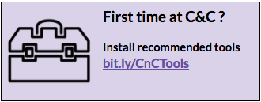

# Coding & Cocktails Session 8:
## Intro to npm (package manager for Node.js) {#intro-to-node-package-manager}

### Overview {#overview}

Dependencies are references to code that someone else wrote. People publish this code by creating node packages. Node packages are open-source, which means you don’t have to pay to use it. Most websites and apps are built with some kind of dependencies.

The mission tonight is to create a simple project and add dependencies to it with **npm**. We’ll use each new dependency in some small way.


While following along with the worksheet, type out the commands instead of doing a copy & paste (_unless instructed to copy & paste_) to avoid inadvertently using any incorrect characters.


### Helpful Keyboard Shortcuts
|Command|Mac Key Combination|Windows Key Combination|
|--|--|--|
|Cut|`cmd` + `x`|`ctrl` + `x`|
|Copy|`cmd` + `c`|`ctrl` + `c`|
|Paste|`cmd` + `v`|`ctrl` + `v`|
|Undo|`cmd` + `z`|`ctrl` + `z`|
|Redo|`cmd` + `y`|`ctrl` + `y`|
|Save|`cmd` + `s`|`ctrl` + `s`|
|Select all|`cmd` + `a`|`ctrl` + `a`|
|Find|`cmd` + `f`|`ctrl` + `f`|
|Switch between open apps/programs |`cmd` + `tab`|`alt` + `tab`|
|Switch between programs on the taskbar| N/A | `windows key` + `tab`|
|Switch between Chrome windows. |`shift` + `cmd` + `~`| N/A |

 
