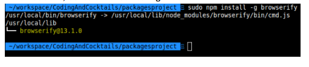

### Part 4: Install Browserify (Globally) {#part-4-install-browserify-globally}

Browserify will allow you to easily consume new dependencies with the JavaScript **require** statement.

1.  On the command line, type: `npm install -g browserify`

  
  The `-g` flag means we're installing the **npm** Browserify package globally (across your computer's operating system). That means you'll be able to use Browserify in your CLI across multiple projects by typing `browserify <command>`, which we'll use in a little bit.
  

2.  It will show a progress bar (of sorts) as it installs.

  <!--
  
  #### Sudo warnings & passwords
  The **sudo** prefix is like running an application as **root** or **administrator**. On a mac, you might get a warning like _Improper use of the sudo command could lead to data loss..._ We're not doing anything dangerous here, just installing the browserify tool via **npm**, which requires this level of system access.

  Also, when you type your password on the command line, you won't be able to see it. This is normal. Just type it as you would normally and press enter.
  
  -->

3.  When it’s done, it should look something like this:
  
