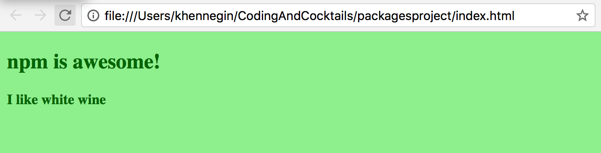

### Part 6: Use the new dependency {#part-6-use-the-new-dependency}

Now we’re ready to put the new dependency (lodash) to good use.

1.  In Atom, copy or type the following into _index.js_, then save again:  
_Note: You do not need to add the comments `//L1`, etc. Those are there to help walk through what the code is doing in the below hint._

  ```
  var _ = require('lodash');                                   //L1
  var wine = 'I like red wine';                                //L2
  var h4Heading = document.querySelector('h4');                //L3
  h4Heading.textContent = _.replace(wine, 'red', 'white');     //L4
  ```

  
  We're using JavaScript and a new library, **lodash**, here. Can you tell what it's doing based on reading it? This is a good example of where using good names for variables and functions improves the readability of the code. Even if you don't know JavaScript, you can read through it and have a general idea of what is happening.

  Let's walk through it. (Notice the comments at the end of each line, which are representing line numbers for us.)

  * **L1**: This is using a simple require statement to include the **lodash** library, and assigning it to `_`, so we can use the shortcut `_` in order to use the **lodash** library. **Browserify** allows us to use this simple require statement to include the **lodash** package. Later, we'll use **Browserify** to bundle up our JavaScript file with **lodash**.

  * **L2**: Sets a variable, **wine**, to the string **I like red wine**.

  * **L3**: Uses JavaScript to select the `<h4>` element in the browser and sets it to the variable **h4Heading**. Did you notice that empty header element [`<h4></h4>`] in our _index.html_ file earlier?

  * **L4**: Uses the **replace** method from **lodash** `_.replace` to replace the word **red** with **white** in the string `I like red wine` and sets the text of our `<h4>` element to this updated string.


  You can always refer back to our JavaScript worksheets if that was all foreign.
  [bit.ly/CnCJunWork](http://bit.ly/CnCJunWork) & [bit.ly/CncJulWork](http://bit.ly/CncJulWork

  Learn more about lodash and the other methods you can use: [lodash.com/](https://lodash.com/).
  

2.  Did you notice that our _index.html_ file is including a Javascript file named _bundle.js_? But we just added code to _index.js_, so did we do something wrong? Nope! No typo here, this is intentional.  

  We're going to use the **Browserify** package we installed earlier to bundle our _index.js_ and any dependencies into the _bundle.js_ file that our _index.html_ is looking for. On the command line, type: `browserify index.js > bundle.js`

3. Open the _bundle.js_ file in Atom. It looks a lot different than our _index.js_ file. Toward the top, we have code that looks like our _index.js_ file, but after that is a lot of code we didn't write. That code belongs to the **lodash** library. Since our code required **lodash**, **Browserify** bundled it with our code.

4. Refresh (or open again) _index.html_ in Chrome.

Your rendered HTML file should look like this:

