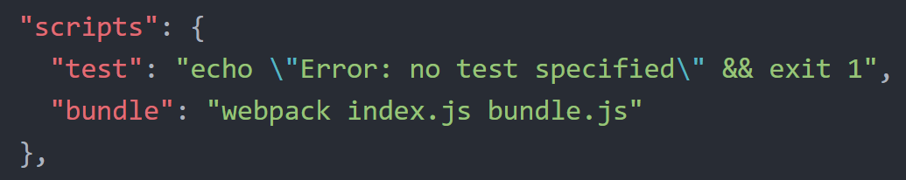

### **npm** Scripts & Browserify-like Webpack

Earlier we used **Browserify** to bundle our JavaScript files. **Webpack** is another tool that developers use as it offers similar & yet more robust capabilities. However, after using **Browserify**, it can be intimidating to use **Webpack**, so let's tackle it.

In your CLI, make sure `pwd` [your current working directory] is _packagesproject_.

  1. First, we need to install **Webpack**. Instead of installing it globally [like we did with **Browserify**], we're going to install it to our project. In your CLI, type: `npm install webpack --save-dev`  

  
  This installs the **Webpack** package and adds it to your _package.json_ in the `devDependencies` section. We install it as a dev dependency since we only want to use the package for the development of our project and we won't be including **Webpack** with our application in production.

   You can install either **Browserify** or **Webpack** globally [with `-g` flag or locally to the project]. We're installing **Webpack** to our project to illustrate the difference.
  

  2. You can use **Webpack** very similar to **Browserify**. Delete the bundle.js file from your project & in your CLI type: `webpack index.js bundle.js`

  What's that? You got an error? `'webpack' is not recognized as an internal or external command, operable program or batch file.`

  Oh yea, that's because we installed **Webpack** locally.

  Let's use the `webpack` command out of our project's local _node_modules_. In your CLI, type: `./node_modules/.bin/webpack index.js bundle.js`

  

  
  If you open the generated _bundle.js_ file, you'll notice it's larger than the **Browserify** version. Your code is in there (might use Atom's search b/c it's a bit hidden in there), **lodash** is in there **and** there is some extra **Webpack** code in there that enables **Webpack** to do its own thing.
  

  3. Obviously having to type `./node_modules/.bin/webpack index.js bundle.js` everytime you want to build your file isn't ideal. Let's add an **npm** script to make our lives easier. Open your _package.json_ file in Atom.

  4. There is already a script in there, look for the following:
  ```
  "scripts": {
      "test": "echo \"Error: no test specified\" && exit 1"
  },
  ```

  Add a comma at the end of the line that starts with `"test"` (after the ending quote) & hit enter.

  On the new line, type: `"bundle": "webpack index.js bundle.js"`

  It should look like the following:

  

  
  Whoa. Why didn't you have to include the `./node_modules/.bin/` in front of `webpack`?

  That's because since the package is installed locally to the project, the **npm** script can find the command by simply using the command name.
  

  5. Now, you can run the **npm** script by typing the following in your CLI: `npm run bundle`

  
  Anything in the **scripts** portion can be run with `npm run <propertyName>`, where **propertyName** is whatever you've set in the quotes before the `:`.
  


### Webpack with Config

So using **Webpack** like **Browserify** was pretty straightforward, but you're probably not going to find anything like that in a real life project. So let's jump into a more realistic example.

  1. In your _packagesproject_ directory, create a new file & name it: **webpack.config.js**

  2. Open the _webpack.config.js_ in Atom and add the following & save the file:

  ```
  module.exports = {
      entry: './index.js',
      output: {
        filename: './bundle.js'
      }
  };
  ```

  
  The **module.exports** is a bit out of scope for tonight's session. We'll cover it a bit next month, but it is basically exposing the **entry** and **output** properties so that the **Webpack** utility can find and use them.

  **entry** is our main JavaScript file [like the **main** property we specified in our _package.json_]

  **output** can take multiple properties, but we're only going to use one, the **filename** - which is the file name we want to use for the bundled JavaScript file
  

  3. Now that you have the config file set up, you can use the `webpack` command by itself to generate the _bundle.js_ file. Since we don't have **Webpack** installed globally, we'd still have to do `./node_modules/.bin/webpack`, so let's add a couple scripts to make our lives easier.

  4. Open _package.json_ in Atom & add the following scripts:

  ```
  "build": "webpack",
  "minbuild": "webpack -p",
  "watch": "webpack --watch"
  ```

  
  Scroll up to our earlier example if you need a reminder on where to add these.
  

  5. Let's try running each of these scripts. In your CLI, type: `npm run build`  

  This command works just like our **Browserify** or earlier **Webpack** commands, the _bundle.js_ has our code, **lodash** & some **Webpack** code.

  6. Now, let's do the one with the `-p` flag. In your CLI, type: `npm run minbuild`

  The `-p` flag is short for **production** and using it makes your _bundle.js_ file ready for production. What does that mean? In short, it **minifies** the _bundle.js_ file. Open the _bundle.js_ file in Atom & take a look. It should like a bunch of random letters/numbers all squished together.

  
  **Minification** is meant to reduce the file size, which in turn means the file can load faster in a browser and boost your application's performance. In minification, extra whitespace is removed [spaces between words/logic, line breaks -- all of it]. It takes your very descriptive variable/method names and replaces them with a few letters that appear random.

  They just appear random, the variable/method names still match up in the code base, so your application still runs the same as it did before. [Take the variable `wine`. It would be replaced everywhere in the code with `w`.]

  When you're working on a large project, the code can get very large, so minifying helps to make the application's performance better with files reduced in size.
  

  7. Watch, this is going to be fun [pun intended]. In your CLI, type: `npm run watch`

  **Webpack** is now watching your code for changes. That means you can update the code in _index.js_ & when you save the file, **Webpack** will automatically update the _bundle.js_ file. If you reload _index.html_ in Chrome, you'll see the updates without having to run a command.

  
  In order to stop the **watch** command from continuing to run in the CLI, we need to stop it. On a Mac, the shortcut is **cmd** + **c**. On Windows, the shortcut is **ctrl** + **c**.
  

  8. So that's fun, but refreshing is one more step. We can do better. In your CLI, type: `npm install webpack-dev-server --save-dev`

  This is installing another **Webpack** package.

  9. Open your _package.json_ in Atom and add the following script:

  `"start": "webpack-dev-server --open"`

  This script will start the **webpack-dev-server**.

  10. Open your _webpack.config.js_ file in Atom. Add a `,` after the closing curly brace for `output` and add the following:

  ```
  devServer: {
        contentBase: './'
  }
  ```

  This is telling the **webpack-dev-server** what directory to look for file changes, which is the root/top-level directory of our project.

  The _webpack.config.js_ file should look like this:

  ```
  module.exports = {
        entry: './index.js',
        output: {
          filename: './bundle.js'
        },
        devServer: {
          contentBase: './'
        }
  };
  ```

  11. In the CLI, type `npm run start`

  The dev server is now watching your code & will automatically reload the browser, if you make any changes.

  12. Open _index.html_ in Chrome, and open _index.js_ in Atom. If you can, make them side-by-side, so you can see Chrome, while you make a change to the code.

  13. Update `white` in _index.js_ to be `blue` and save the file. Chrome should automagically refresh and show you the new code.

  
