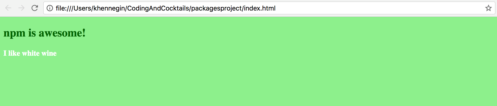

# Homework {#homework}

The more you practice, the better you’ll get. Reinforce what you’ve learned tonight with the following tutorial.

[](http://kcwit.slack.com)

### Part 1: Use the new jQuery dependency {#part-1-use-the-new-jquery-dependency}

Your _index.js_ file already contains one way of selecting an element (`document.querySelector`). Now that you have jQuery, you can do this another way:

1.  In Atom, open the _index.js_ file and type the following code anywhere in the file:

  ```
  var $ = require('jquery');
  $('h4').css('color', 'white');
  ```

2.  On the command line, type the browserify command again: `browserify index.js > bundle.js`

3.  Refresh (or reopen) _index.html_ in Chrome.

Your rendered HTML file should look like this:




### Part 2: Initialize your project as a git repository {#part-2-initialize-your-project-as-a-git-repository}

Start tracking your progress with git. We’re going to tell git what it should _and should not_ care about.

1.  On the command line, type the following: `git init`

2.  Now type: `git status` This command lists the files and folders git thinks it should track.

3.  In Atom, create a new file called **.gitignore** (note, this file starts with a dot). See Part 2 of the project section above if you need help creating new files.

4.  Add the following to the **.gitignore** file and save it:

        node_modules/
        bundle.js

        #For macs
        .DS_Store

5.  Back on the command line, type this again: `git status` Notice that the **node_modules** folder and **bundle.js** file are no longer listed.

6.  Stage and commit these files.<br>

  
  #### Don't remember git?

  See the git version control worksheet from April: [bit.ly/CnCAprWork](http://bit.ly/CnCAprWork)
  


### Part 3: Continue to discover new dependencies and try them out! {#part-3-continue-to-discover-new-dependencies-and-try-them-out}

The world is your oyster! Check out all of the packages available at [**http://www.npmjs.com**](http://www.npmjs.com).
