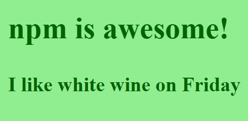

# Homework {#homework}

The more you practice, the better you’ll get. Reinforce what you’ve learned tonight with the following tutorial.


##### Hey Slacker!

Remember, we're here to help.
Join the KCWiT #codingandcocktails Slack Channel: [kcwit.slack.com](http://kcwit.slack.com)


## Use the new Moment dependency

At the end of the worksheet, we added the Moment library for working with dates. Now you can incorporate it into your _index.js_ file to add some fun manipulation to your wine statement:

1.  In Atom, open the _index.js_ file. Add a new line after the first line that requires lodash (`var _ = require('lodash');`) and type the following code:

  ```javascript
  var moment = require('moment');
  var today = moment().format('dddd');
  ```

1.  In the _index.js_ file, update the code setting the wine variable to the following code:

  ```javascript
  var wine = 'I like red wine on ' + today;
  ```

1.  On the command line, type the browserify command again: `browserify index.js > bundle.js` <i class="fa fa-share fa-rotate-180"></i>.

1.  Refresh (or reopen) _index.html_ in Chrome.

Your rendered HTML file should look like this (with whatever day you're working on the homework):



_Check it out in Chrome again tomorrow to see the day change!_


## Initialize your project as a git repository

Start tracking your progress with git. We’re going to tell git what it should _and should not_ care about.

Install Git prior to starting this homework assignment. Follow the [instructions in The Tools](https://codingandcocktailskc.gitbooks.io/coding-cocktails-the-tools/content/tools-git/) to install Git. You will have to close and reopen your terminal.


1. On the command line, type the following: `git init` <i class="fa fa-share fa-rotate-180"></i>.

1. Now type `git status` <i class="fa fa-share fa-rotate-180"></i>. This command lists the files and folders git thinks it should track.

1. In Atom, create a new file called **.gitignore** (note, this file starts with a dot).

1.  Add the following to the **.gitignore** file and save it:

        node_modules/
        bundle.js

        #For macs
        .DS_Store

1. Back on the command line, type this again `git status` <i class="fa fa-share fa-rotate-180"></i>. Notice that the **node_modules** folder and **bundle.js** file are no longer listed.

1. Stage and commit these files.<br>

  
#### Don't remember git?

See the git version control worksheet from April: [bit.ly/CnCAprWork](http://bit.ly/CnCAprWork)
  


## Continue to discover new dependencies and try them out!

The world is your oyster! Check out all of the packages available at [**http://www.npmjs.com**](http://www.npmjs.com).
