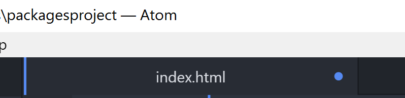
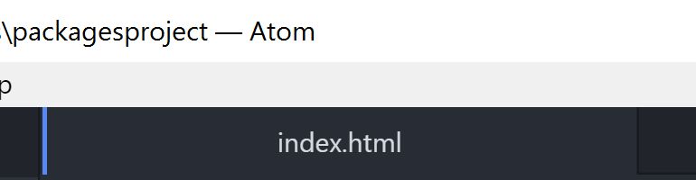
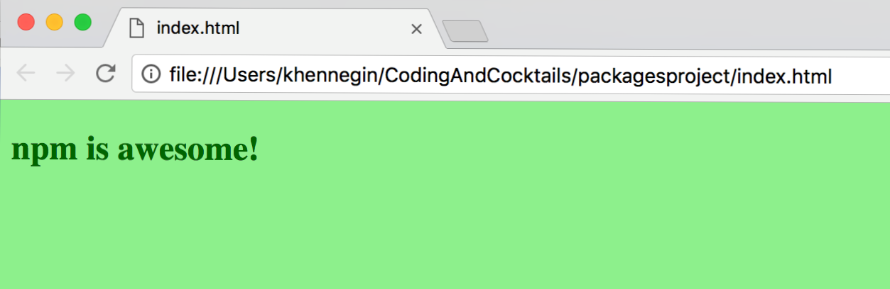

## Create the project files

1. In Atom, right click on the "packagesproject" folder in the left sidebar and choose **New File**.

1. At the prompt to name the file, type "index.html" and press `Enter`.

1. Enter the following HTML and then save the file (**Ctrl+S** or **Cmd+S**):

  ```html
  <!DOCTYPE html>
  <html>
      <head>
        <link rel="stylesheet" type="text/css" href="main.css">
      </head>
      <body>
        <h2>
          npm is awesome!
        </h2>
        <h4>
        </h4>
        <script src="bundle.js"></script>
      </body>
  </html>
  ```

  
  Can you tell what is going on in this HTML? Grab your neighbor and take turns walking through each `<tag>`.

  If this is your first time with us, note the indentation in the code. Indentation is important when structuring your code to make it more readable. Even if this is your first time looking at HTML, you can see the indentation helps your eyes to follow from an `<opening>` HTML tag [like `<head>`] to the `</closing>` tag [like `</head>`]. And the children HTML elements are indented between.

  Need a refresher? Revisit the HTML worksheet from January:
  [bit.ly/CnCJanWork](http://bit.ly/CnCJanWork)
  

  
In Atom, if a file has been modified but not saved, the tab shows a dot. Often, the answer to "Why isn't my code working?" is "Oh, I didn't save the file".

#### Unsaved:


#### Saved:

  

1. Let's add some styles to our HTML with a bit of color. Repeat steps 1-2 to create a file named "main.css".

1. Enter the following CSS and then save the file:

  ```css
  body {
      background-color: lightgreen;
  }

  h1, h2, h3, h4, h5, h6 {
      color: darkgreen;
  }
  ```

  
Compare this CSS to the HTML above. Can you guess what it will look like in the browser?

Use the CSS worksheet from February, if you need a reminder:
[bit.ly/CnCFebWork](http://bit.ly/CnCFebWork)
  

1. Repeat steps 1-2 to create a file named "index.js" (it remains empty).

1. In Chrome, navigate to your _index.html_ file: **file:///&lt;yourHomeDirectory&gt;/CodingAndCocktails/packagesproject/index.html**

  <!--sec data-title="Chromebooks Only: Cloud9 Instructions" data-id="section0" data-show=true data-collapse=true ces-->
  The CodeAnywhere workspace is all-inclusive, so the process to view the rendered HTML file is a bit different than looking at a local file in Chrome from your computer.
  
  Right click on the _index.html_ in the left sidebar to open a context menu and select **Preview**. This opens a new tab in Chrome to view your file.
  <!--endsec-->

Your rendered HTML file should look like this:


