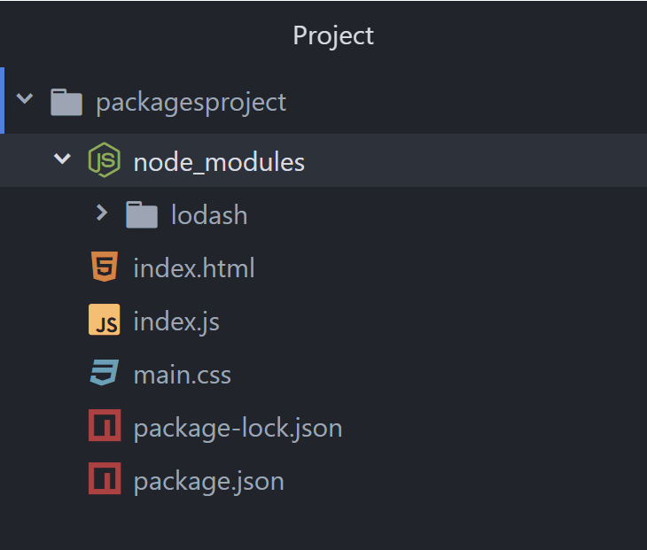

## Install a dependency via command line

Just like the `init` command, **npm** provides an easy way to add a dependency via command line, too. In this part, we'll add a dependency on **lodash** using this method.


**Lodash** is a library that helps you manipulate JSON objects in JavaScript. This can be very handy if you want to:
- sort an array (alphabetically, or in some other way)
- replace words in a string
- generate a random number
- and much much more!

Lodash - along with hundreds of other libraries - are available via **npm**. The URL for this is: https://www.npmjs.com/package/lodash

This is the **home** of the library on **npm**, where you can find links to the author(s), documentation, support, etc. Try substituting the last part with another library, such as **jquery**.


1. On the command line, type `npm install lodash` <i class="fa fa-share fa-rotate-180"></i>.

  
#### npm warnings

This command will warn that you don't have a description or repository filled out in your _package.json_ file. You don't need to worry about this right now.
  

  
Since this is the first package we're installing for our project, you'll notice it created a couple new things in our project folder:
* **_node_modules_ (new directory)**  
This is where all our project's packages will be installed.
* **_package-lock.json_ (new file)**  
This is a lock file. It's similar to our _package.json_, in that it includes our packages and the versions that we want installed. However, this file is more specific, as it also includes the packages and versions of any packages used by our immediate dependencies. Look for the bonus exercise on lock files later in this worksheet to learn more.
  

1. When it’s done, notice the new dependency is listed in the _package.json_ & _package-lock.json_ files. It also downloaded the lodash library to the "_node_modules_" folder.

  
