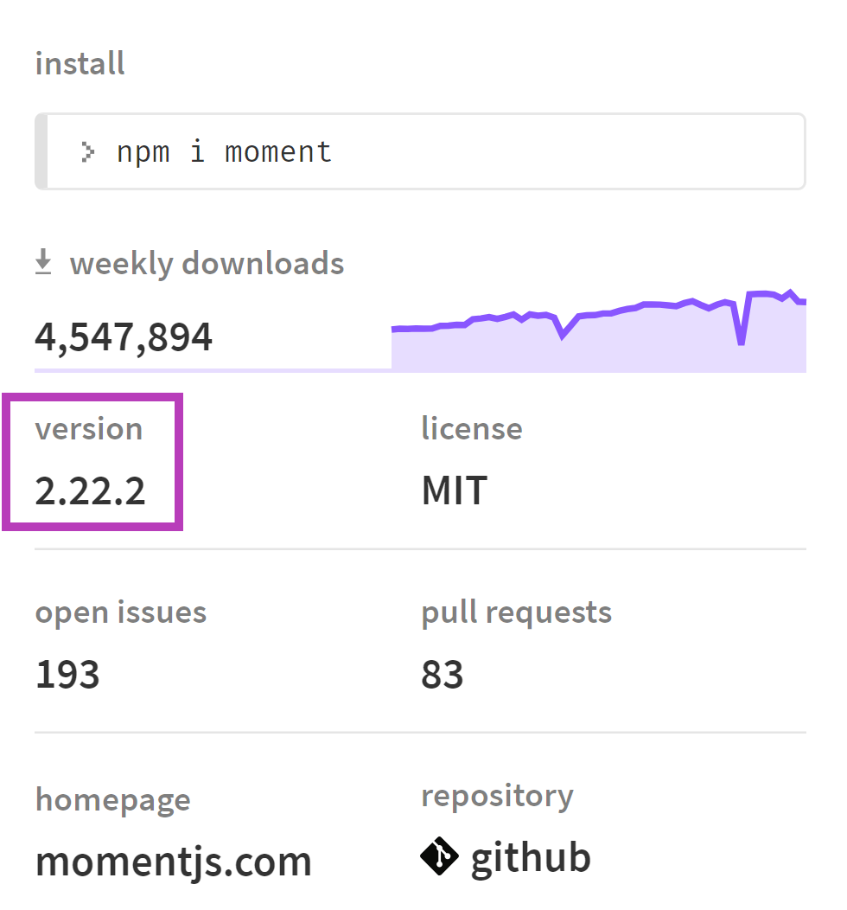
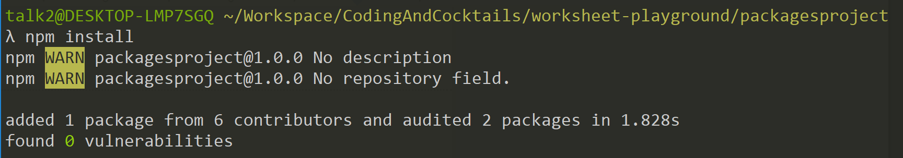
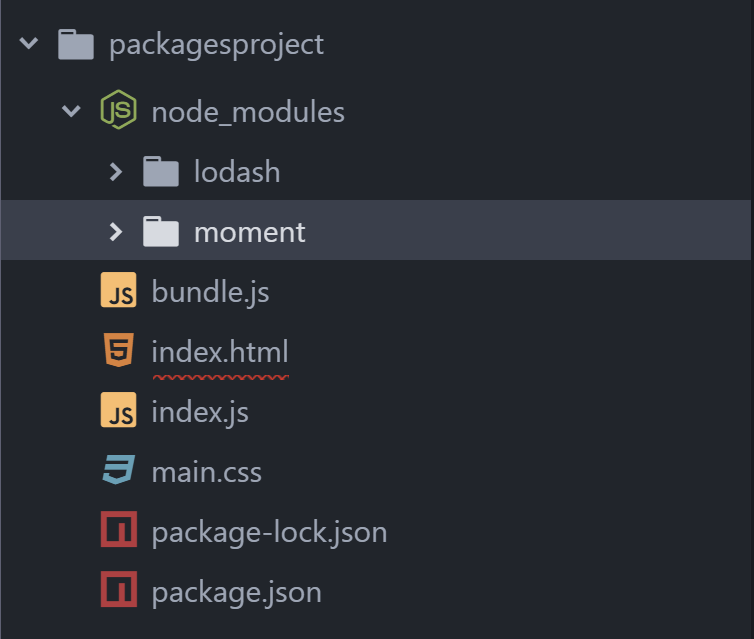

## Install a dependency via package.json directly

You can also add a dependency to the _package.json_ directly. In this part, we'll add a dependency on **moment** using this method.

1. In Atom, open the _package.json_ file.

1. In Chrome, go to: [https://www.npmjs.com/package/moment](https://www.npmjs.com/package/moment)

1. Notice the latest version of Moment in the right sidebar:  
  

1. In the dependencies section, add a comma at the end of the lodash line, press `Enter` and type the following on the new line. Then save again:

  `"moment": "^2.22.2"`

  
For more information about the format of these versions (i.e. **^2.22.2**), checkout **npm** documentation here:
https://docs.npmjs.com/getting-started/semantic-versioning
  

1. On the command line, type: `npm install` <i class="fa fa-share fa-rotate-180"></i>.
  This installs any dependencies listed in  _package.json_, that aren't already installed.

  

  Note that command line only informs you that it `added 1 package`, but doesn't mention which package. You will notice the new dependency listed in the _package-lock.json_ file. It also downloaded the moment library to the _node_modules_ folder.

  
