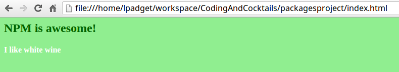

### Part 1: Use the new jQuery dependency {#part-1-use-the-new-jquery-dependency}

Your index.js file already contains one way of selecting an element (document.querySelector). Now that you have jQuery, you can do this another way:

1.  In Sublime, open the **index.js** file and place the following code anywhere in the file:

        var $ = require('jquery');
        $("h4").css("color", "white");

1.  On the command line, type the browserify command again: ``browserify index.js > bundle.js``
2.  Refresh (or reopen) **index.html** in your browser.

Your rendered HTML file should look like this:

