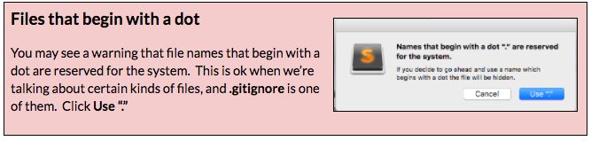

### Part 2: Initialize your project as a git repository {#part-2-initialize-your-project-as-a-git-repository}

Start tracking your progress with git. We’re going to tell git what it should _and should not_ care about.

1.  On the command line, type the following: ``git init``
2.  Now type: ``git status`` This command lists the files and folders git thinks it should track.
3.  In Sublime, create a new file called **.gitignore** (note, this file starts with a dot). See Part 2 of the project section above if you need help creating new files.

1.  Add the following to the **.gitignore** file and save it:

        /node_modules
        bundle.js
        
        #For macs
        .DS_Store

1.  Back on the command line, type this again: ``git status`` Notice that the **node_modules** folder and **bundle.js** file are no longer listed.
2.  Stage and commit these files.
