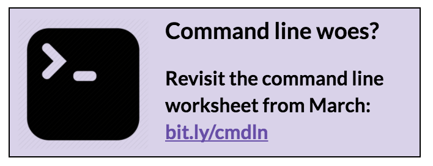
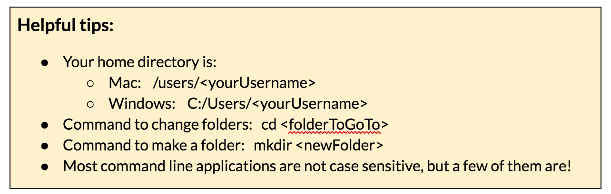
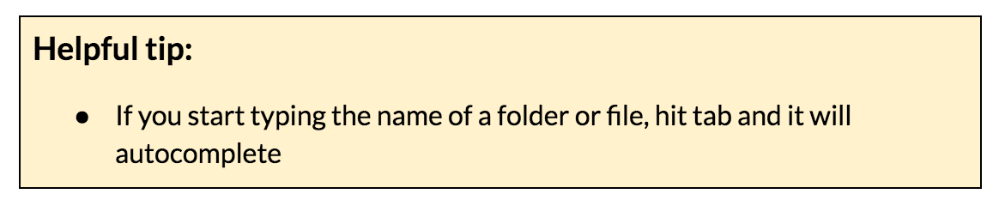
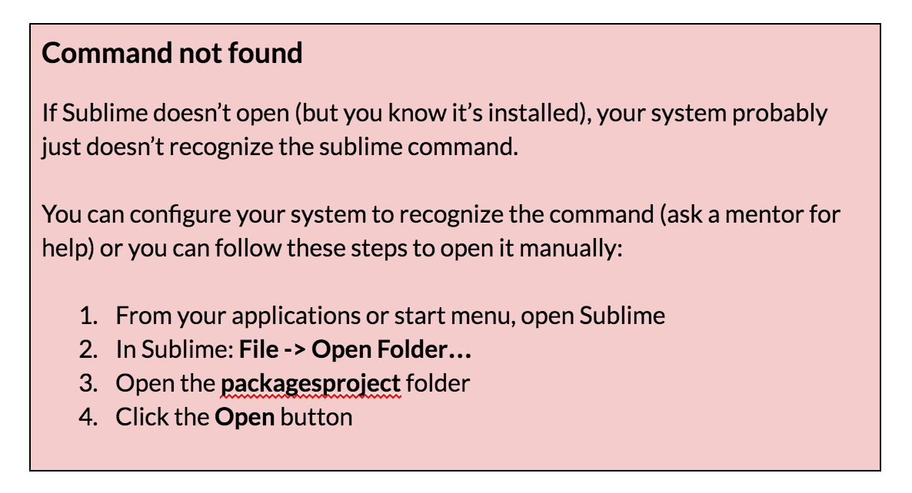

### Part 1: Create a project folder {#part-1-create-a-project-folder}

When you’re starting from scratch, an empty project is simply an empty folder. You could do that visually (using your file explorer) but let’s do it on the command line.

1.  Navigate to your CodingAndCocktails folder: ``cd [yourHomeDirectory]/CodingAndCocktails``

1.  Make a new folder called packagesproject: ``mkdir packagesproject``
2.  Move into that new folder: ``cd packagesproject``

1.  Open the Sublime text editor from here: ``subl .``

