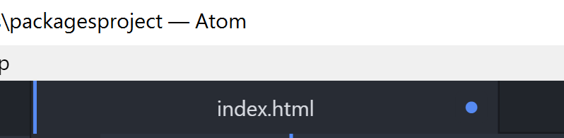
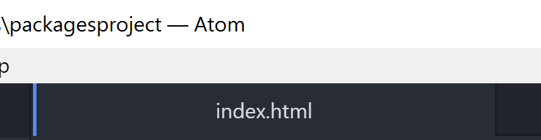
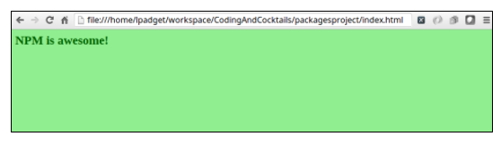

### Part 2: Create the project files {#part-2-create-the-project-files}

All of these steps are performed inside Atom.

1.  Right click on the _packagesproject_ folder in the left sidebar and choose **New File**
2. You will be prompted to name the file. Type **index.html** & hit enter
3.  Enter the following HTML and then save the file (**Ctrl+S** or **Cmd+S**):

        <!DOCTYPE html>
        <html>
          <head>
             <link rel="stylesheet" type="text/css" href="main.css">
          </head>
          <body>
            <h2>
              npm is awesome!
            </h2>
            <h4>
            </h4>
            
          </body>
        </html>

  
  In Atom, if a file has been modified but not saved, the tab shows a dot. Often, the answer to "Why isn't my code working?" is "Oh, I didn't save the file".

  Unsaved:
  

  Saved:
  
  
1.  Repeat steps 1-3 to create a file called **main.css**
2.  Enter the following CSS and then save again:

        body {
          background-color: lightgreen;
        }

        h1, h2, h3, h4, h5, h6 {
          color: darkgreen;
        }
1. Repeat steps 1-3 to create a file called **index.js** (it remains empty)
2. In Chrome, navigate to your _index.html_ file: **file:///<yourHomeDirectory>/CodingAndCocktails/packagesproject/index.html**

Your rendered HTML file should look like this:

