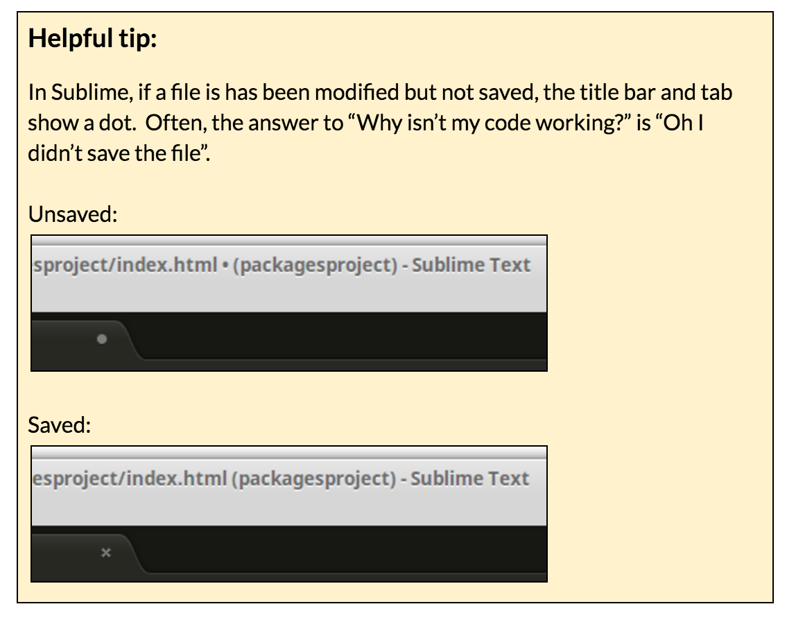

### Part 2: Create the project files {#part-2-create-the-project-files}

All of these steps are performed inside Sublime.

1.  Right click on the packagesproject folder and choose **New File**
2.  Save the file (**Ctrl+S** or **Cmd+S**). This will prompt you for a file name.
3.  Enter **index.html** and click the **Save** button.
4.  Enter the following HTML and then save again:

        <!DOCTYPE html>
        <html>
          <head>
             <link rel="stylesheet" type="text/css" href="main.css">
          </head>
          <body>
            <h2>
              NPM is awesome!
            </h2>
            <h4>
            </h4>
            
          </body>
        </html>

  

1.  Repeat steps 1-3 to create a file called **main.css**
2.  Enter the following CSS and then save again:

        body {
          background-color: lightgreen;
        }
        h1, h2, h3, h4, h5, h6 {
          color: darkgreen;
        }
1. Repeat steps 1-3 to create a file called index.js  (it remains empty)
2. Now in your browser, navigate to your index.html file: **file:///<yourHomeDirectory>/CodingAndCocktails/packagesproject/index.html**

Your rendered HTML file should look like this: