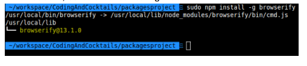

### Part 4: Install Browserify (Globally) {#part-4-install-browserify-globally}

Browserify will allow you to easily consume new dependencies with the javascript **require** statement.

1.  On the command line, type: ``sudo npm install -g browserify``
2.  It will show a progress bar (of sorts). If it prompts you for a password, enter it.

  
  #### Sudo warnings & passwords
  The **sudo** prefix is like running an application as **root** or **administrator**. On a mac, you might get a warning like _Improper use of the sudo command could lead to data loss..._ We're not doing anything dangerous here, just installing the browserify tool via **npm**, which requires this level of system access.

  Also, when you type your password on the command line, you won't be able to see it. This is normal. Just type it as you would normally and press enter.
  

1.  When it’s done, it should look something like this:

