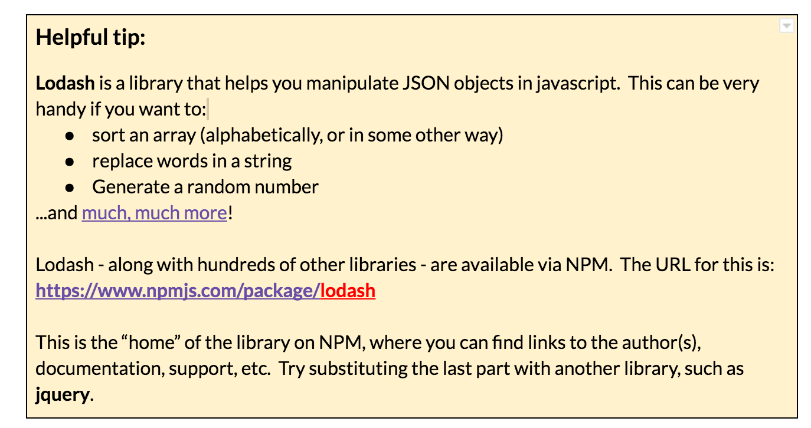
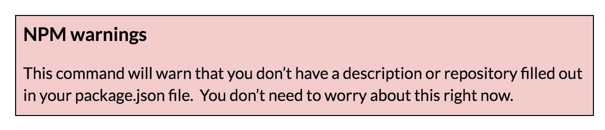

### Part 5: Install a dependency via command line {#part-5-install-a-dependency-via-command-line}

Just like the init command, NPM provides an easy way to add a dependency via command line, too. In this part, we’ll add a dependency on **lodash** using this method.

1.  On the command line, type: ``npm install --save lodash``

    

1.  When it’s done, notice the new dependency is listed in the package.json file. It also downloaded the lodash library to a folder called node_modules.
