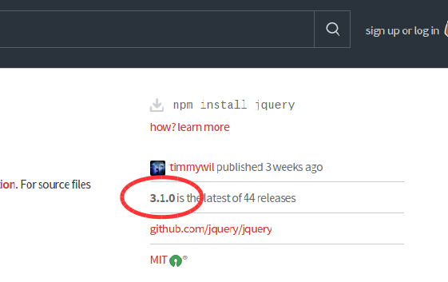
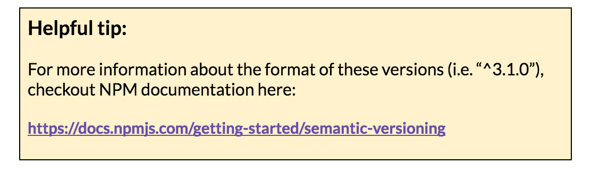

### Part 7: Install a dependency via package.json directly {#part-7-install-a-dependency-via-package-json-directly}

You can also add a dependency to the package.json directly. In this part, we’ll add a dependency on **jquery** using this method.

1.  In Sublime, open the **package.json** file.
2.  In your browser, go to: [**https://www.npmjs.com/package/jquery**](https://www.npmjs.com/package/jquery)
3.  Notice the latest version of jQuery in the upper right corner:
  
1.  In the dependencies section, add a comma after the lodash line, and then the following. Then save again:

    ``"jquery": "^3.1.0"``

    

1.  On the command line, type: ``npm install``
2.  This will install any dependencies you just added to the package.json file.