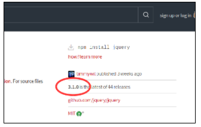

### Part 7: Install a dependency via package.json directly {#part-7-install-a-dependency-via-package-json-directly}

You can also add a dependency to the _package.json_ directly. In this part, we'll add a dependency on **jquery** using this method.

1.  In Atom, open the _package.json_ file.

2.  In Chrome, go to: [https://www.npmjs.com/package/jquery](https://www.npmjs.com/package/jquery)

3.  Notice the latest version of jQuery in the right sidebar:
  

4.  In the dependencies section, add a comma at the end of the lodash line, hit enter and type the following on the new line. Then save again:

  `"jquery": "^3.2.1"`

  
  For more information about the format of these versions (i.e. **^3.2.1**), checkout **npm** documentation here:
  https://docs.npmjs.com/getting-started/semantic-versioning
  

5.  On the command line, type: `npm install`

6.  This will install any dependencies you just added to the _package.json_ file.
